# Open-Source_Hardware_Maker
我的开源硬件创客课程作业

## 1. 第一次课 Python 入门与OpenCV
### 1.1 作业1：打地鼠

#### 1.1.1 代码

```
import cv2
import random

partsHeight: int = 50
partsWidth: int = 50
size = 3
score = 0
chessboard = [[0, 0, 0], [0, 0, 0], [0, 0, 0]]


def draw_grid():
    for i in range(0, size):
        for j in range(0, size):
            # 画网格
            pt0 = (int(width / 2 - partsWidth * size / 2 + j * partsWidth),
                   int(height / 2 - partsHeight * size / 2 + i * partsHeight))
            pt1 = (int(width / 2 - partsWidth * size / 2 + j * partsWidth + partsWidth),
                   int(height / 2 - partsHeight * size / 2 + i * partsHeight + partsHeight))
            cv2.rectangle(img, pt0, pt1, (255, 0, 0), 1)


def draw_source():
    for i in range(0, size):
        for j in range(0, size):
            # 如果随机数x>5才拷贝选定区域图片
            if random.randint(1, 9) > 5:
                img[int(height / 2 - partsHeight * size / 2 + i * partsHeight):int(
                    height / 2 - partsHeight * size / 2 + (i + 1) * partsHeight),
                int(width / 2 - partsWidth * size / 2 + j * partsWidth):int(
                    width / 2 - partsWidth * size / 2 + (j + 1) * partsWidth)] = source
                chessboard[i][j] = 1


def set_score(event, x, y, flags, param):
    global score
    if event == cv2.EVENT_LBUTTONDBLCLK or event == cv2.EVENT_RBUTTONDBLCLK:
        # cv2.circle(img, (x, y), 50, (255, 0, 0), 2)
        # print("%d %d" % ((x // partsWidth - 3), y // partsHeight - 2))
        row = y // partsHeight - 2
        col = x // partsWidth - 3
        if chessboard[row][col] == 1:
            score += 10
        else:
            if score >= 5:
                score -= 5


def reset():
    for i in range(0, size):
        for j in range(0, size):
            chessboard[i][j] = 0


def show_HP():
    cv2.rectangle(img, (width - 5, 5), (width - 105, 25), (0, 0, 255), 1)
    cv2.rectangle(img, (width - 105 + score, 5), (width - 105, 25), (0, 255, 0), -1)


while True:
    # Load a color image
    img = cv2.imread('dragon.jpg', cv2.IMREAD_COLOR)  # image 426(width)*319(height)
    cv2.namedWindow('dragon')
    cv2.setMouseCallback('dragon', set_score)
    height, width, color = img.shape
    source = img[50:50 + partsHeight, 120:120 + partsWidth]  # img[row, column]

    draw_source()
    draw_grid()
    show_HP()
    cv2.imshow('dragon', img)

    if cv2.waitKey(1000) == 27:
        break
    if score > 100:
        img2 = cv2.imread('fireworks.jpg', cv2.IMREAD_COLOR)
        cv2.imshow('fireworks', img2)
        cv2.waitKey(1000)
        break
    reset()
cv2.destroyAllWindows()
```
#### 1.1.2 图片原图  

#### 1.1.3 演示效果图  
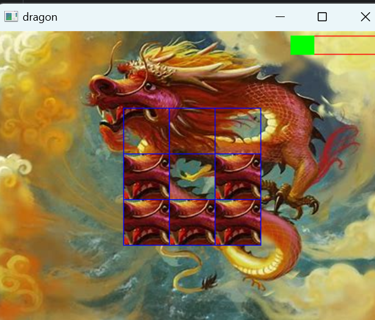

## 2. 第二次课电子积木

### 2.1作业1输入歌名播放音乐

#### 2.11代码

```python
import serial
import time

ser = serial.Serial("COM4")

time.sleep(3)
song1 = [1, 1, 5, 5, 6, 6, 5, 4, 4, 3, 3, 2, 2, 1]
song2 = [1, 2, 3, 1, 1, 2, 3, 1, 3, 4, 5]
song3 = [1, 1, 3, 5, 5]
record = {'tickle': 1, 'tiger': 2, 'bug': 3}
name = input("Please enter a name of a song: ")

if record[name] == 1:
    song = song1
elif record[name] == 2:
    song = song2
elif record[name] == 3:
    song = song3
else:
    print('no such song')
    exit(1)
for note in song:
    a = str(note)
    ser.write(a.encode())
    time.sleep(2)
    
```

### 2.2作业2读取文件中的歌谱播放音乐

#### 2.2.1代码

```python
import serial
import time

ser = serial.Serial("COM4")
time.sleep(3)

try:
    file = open('record.csv', 'r', encoding='utf-8-sig')
except FileNotFoundError:
    # 文件不存在的错误处理
    print("File not found.")
    exit(1)

line1 = file.readline()
line2 = file.readline()
line3 = file.readline()
record1 = line1.split(',')
record2 = line2.split(',')
record3 = line3.split(',')

name = input("Please enter a name of a song: ")

if name == record1[0]:
    song = [int(item) for item in record1[1:]]
elif name == record2[0]:
    song = [int(item) for item in record2[1:]]
elif name == record3[0]:
    song = [int(item) for item in record3[1:]]
else:
    print('no such song')
    exit(1)
for note in song:
    a = str(note)
    ser.write(a.encode())
    time.sleep(2)
    
```

## 3.第三次课我的世界和人脸识别

### 3.1作业1拷贝交大的地图到相应目录，重启bukkit服务器，利用welcomehome找到自己宿舍的坐标，把家定到自己的宿舍

#### 3.1.1代码

```
from mcpi.minecraft import Minecraft
import time

mc = Minecraft.create()
pos = mc.player.getTilePos()
print("player pos is", pos)

# mc.setBlock(pos.x,pos.y,pos.z,1)

stayed_time = 0
while True:
    print("stay_time" + str(stayed_time))
    time.sleep(1)
    pos = mc.player.getTilePos()
    mc.postToChat("please go to home x=201 y=-5 z=335 for 15s to fly")
    mc.postToChat("x:" + str(pos.x) + "y:" + str(pos.y) + "z:" + str(pos.z))
    # 修改为方块交大中我的宿舍的地址
    if pos.x == 104 and pos.z == -550 and pos.y == 4:
        mc.postToChat("welcome home,count down" + str(15 - stayed_time))
        stayed_time = stayed_time + 1
        if stayed_time >= 15:
            mc.player.setTilePos(201, 5, 335)
            stayed_time = 0
    else:
        stayed_time = 0
```

#### 3.1.2实现截图

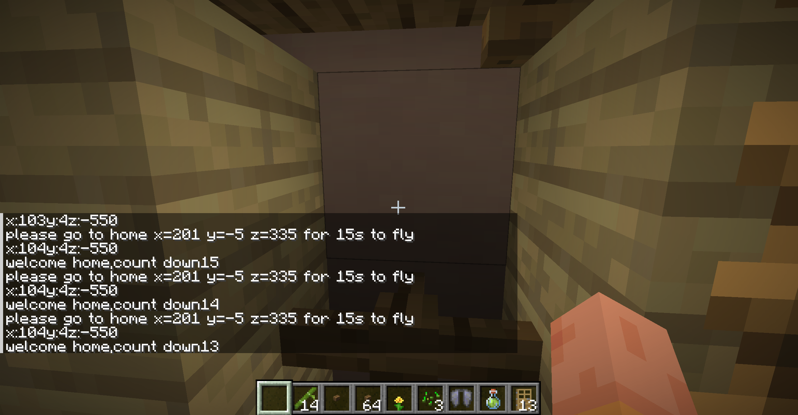

### 3.2作业2利用人脸检测，根据人脸坐标以及大小，实现人脸可以指挥我的世界中的玩家前后左右奔跑

#### 3.2.1代码

```
import numpy as np
import cv2
from mcpi.minecraft import Minecraft

mc = Minecraft.create()
# 调用电脑内置摄像头
cap = cv2.VideoCapture(0)
pos = mc.player.getTilePos()

while (True):
    pos = mc.player.getTilePos()
    ret, img = cap.read()
    H, W, C = img.shape
    face_cascade = cv2.CascadeClassifier('haarcascade_frontalface_default.xml')
    eye_cascade = cv2.CascadeClassifier('haarcascade_eye.xml')
    gray = cv2.cvtColor(img, cv2.COLOR_BGR2GRAY)

    faces = face_cascade.detectMultiScale(gray, 1.3, 5)
    for (x, y, w, h) in faces:
        img = cv2.rectangle(img, (x, y), (x + w, y + h), (255, 255, 0), 2)
    # 通过检测人脸的位置控制人物前进后退
    if x + w * 0.5 < W * 0.5 - 30:
        if h < 250:
            print('BR')
            new_pos = pos.clone()
            new_pos.z += 1
            new_pos.x -= 1
        elif h > 190:
            print('FR')
            new_pos = pos.clone()
            new_pos.z += 1
            new_pos.x += 1
        else:
            print('R')
            new_pos = pos.clone()
            new_pos.z += 1
    elif x + w * 0.5 > W * 0.5 + 30:
        if h < 250:
            print('BL')
            new_pos = pos.clone()
            new_pos.z -= 1
            new_pos.x -= 1
        elif h > 190:
            print('FL')
            new_pos = pos.clone()
            new_pos.z -= 1
            new_pos.x += 1
        else:
            print('L')
            new_pos = pos.clone()
            new_pos.z -= 1
    else:
        if h < 170:
            print('B')
            new_pos = pos.clone()
            new_pos.x -= 1
        elif h > 270:
            print('F')
            new_pos = pos.clone()
            new_pos.x += 1
        else:
            new_pos = pos.clone()
    mc.player.setTilePos(new_pos)
    roi_gray = gray[y:y + h, x:x + w]
    roi_color = img[y:y + h, x:x + w]
    eyes = eye_cascade.detectMultiScale(roi_gray)
    for (ex, ey, ew, eh) in eyes:
        cv2.rectangle(roi_color, (ex, ey), (ex + ew, ey + eh), (0, 255, 0), 2)
    h_img = cv2.flip(img, 1)
    cv2.imshow('img', h_img)
    if cv2.waitKey(1) & 0xFF == ord('q'):
        break

```

#### 3.2.2y优化代码

```python
import numpy as np
import cv2
from mcpi.minecraft import Minecraft
import keyboard
import time

mc = Minecraft.create()
# 调用电脑内置摄像头
cap = cv2.VideoCapture(0)
pos = mc.player.getTilePos()
sleeptime = 0.5

while (True):
    ret, img = cap.read()
    H, W, C = img.shape
    face_cascade = cv2.CascadeClassifier('haarcascade_frontalface_default.xml')
    eye_cascade = cv2.CascadeClassifier('haarcascade_eye.xml')
    gray = cv2.cvtColor(img, cv2.COLOR_BGR2GRAY)

    faces = face_cascade.detectMultiScale(gray, 1.3, 5)
    for (x, y, w, h) in faces:
        img = cv2.rectangle(img, (x, y), (x + w, y + h), (255, 255, 0), 2)
    # 通过检测人脸的位置控制人物
    if x + w * 0.5 < W * 0.5 - 30:
        if h < 170:
            print('BR')
            keyboard.press('d')
            keyboard.press('s')
            time.sleep(sleeptime)
            keyboard.release('d')
            keyboard.release('s')
        elif h > 270:
            print('FR')
            keyboard.press('d')
            keyboard.press('w')
            time.sleep(sleeptime)
            keyboard.release('d')
            keyboard.release('w')
        # 控制人物向右移动
        else:
            print('R')
            keyboard.press('d')
            time.sleep(sleeptime)
            keyboard.release('d')
    elif x + w * 0.5 > W * 0.5 + 30:
        if h < 170:
            print('BL')
            keyboard.press('s')
            keyboard.press('a')
            time.sleep(sleeptime)
            keyboard.release('s')
            keyboard.release('a')
        elif h > 270:
            print('FL')
            keyboard.press('w')
            keyboard.press('a')
            time.sleep(sleeptime)
            keyboard.release('w')
            keyboard.release('a')
        # 控制人物向右移动
        else:
            print('L')
            keyboard.press('a')
            time.sleep(sleeptime)
            keyboard.release('a')
    else:
        # 控制人物向后移动
        if h < 170:
            print('B')
            keyboard.press('s')
            time.sleep(sleeptime)
            keyboard.release('s')
        # 控制人物向前移动
        elif h > 270:
            print('F')
            keyboard.press('w')
            time.sleep(sleeptime)
            keyboard.release('w')
    roi_gray = gray[y:y + h, x:x + w]
    roi_color = img[y:y + h, x:x + w]
    eyes = eye_cascade.detectMultiScale(roi_gray)
    for (ex, ey, ew, eh) in eyes:
        cv2.rectangle(roi_color, (ex, ey), (ex + ew, ey + eh), (0, 255, 0), 2)
    h_img = cv2.flip(img, 1)
    cv2.imshow('img', h_img)
    if cv2.waitKey(1) & 0xFF == ord('q'):
        break
```

## 4.第五次课图像识别

### 4.1作业1：能够检测自己手头小物品的颜色，并能动态显示摄像头上物体以及上面标注的圆圈

#### 4.1.1代码

```python
import cv2
import numpy as np

cap = cv2.VideoCapture(0)

while True:
    # Capture frame-by-frame
    ret, frame = cap.read()
    # Our operations on the frame come here
    frame_hsv = cv2.cvtColor(frame, cv2.COLOR_BGR2HSV)

    lower_color = np.array([6, 160, 210])  # 此时的取值的橙色
    upper_color = np.array([9, 190, 240])

    color_obj = cv2.inRange(frame_hsv, lower_color, upper_color)

    conts, hrc = cv2.findContours(color_obj, cv2.RETR_TREE, cv2.CHAIN_APPROX_SIMPLE)
    # print(conts)

    frame = cv2.drawContours(frame, conts, -1, (0, 255, 0), 3)

    bigconts = []
    for cont in conts:
        area = cv2.contourArea(cont)
        if area > 200:
            bigconts.append(cont)

    for bigcnt in bigconts:
        M = cv2.moments(bigcnt)
        cx = int(M['m10'] / M['m00'])
        cy = int(M['m01'] / M['m00'])
        cv2.circle(frame, (cx, cy), 100, (0, 0, 255), 5)

        frame = cv2.drawContours(frame, bigconts, -1, (255, 0, 0), 10)

    # Display the resulting frame
    frame = cv2.flip(frame, 1)
    cv2.imshow('my show windows', frame)
    if cv2.waitKey(1) & 0xFF == ord('q'):
        break

# When everything done, release the capture
cap.release()
cv2.destroyAllWindows()
```

#### 4.1.2演示效果

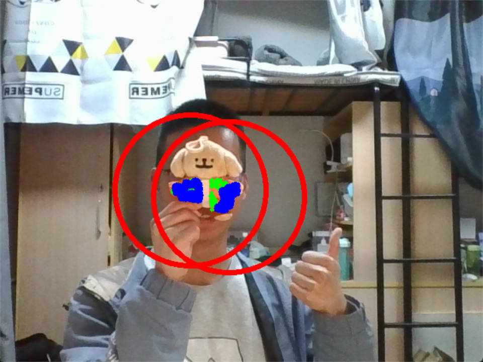

### 4.2作业2：利用git clone 克隆下来ollama的源代码


### 4.3作业3：完成摄像头利用mediapipe检测手势，完成用拇指食指指尖拿捏移动屏幕上的红色圆圈到另一个位置的功能然后放手的功能

#### 4.3.1codes

```
# 作业要求：完成摄像头利用mediapipe检测手势，
# 完成用拇指食指指尖拿捏移动屏幕上的红色圆圈到另一个位置的功能然后放手的功能

# 1.摄像头利用mediapipe检测手势
# 2.在画面上绘制一个红色的圆，圆心的位置随机
# 3.获取食指指尖和拇指指尖的坐标
# 4.当食指指尖和拇指指尖连线中点进入圆范围并且直线长度小于一定值时，将圆的圆心改为食指指尖和拇指指尖连线中点

# STEP 1: Import the necessary modules.
import math
import cv2
import numpy as np
import mediapipe as mp
from mediapipe.tasks.python import vision

cap = cv2.VideoCapture(0)
BaseOptions = mp.tasks.BaseOptions
HandLandmarker = mp.tasks.vision.HandLandmarker
HandLandmarkerOptions = mp.tasks.vision.HandLandmarkerOptions
VisionRunningMode = mp.tasks.vision.RunningMode

# 获取视频的宽度和高度
width = int(cap.get(cv2.CAP_PROP_FRAME_WIDTH))
height = int(cap.get(cv2.CAP_PROP_FRAME_HEIGHT))
center_x = int(width / 2)
center_y = int(height / 2)
radius = 30
distance = -1
midpoint_x = 1
midpoint_y = 1
circle_center_x = int(width / 2)
circle_center_y = int(height / 2)


def draw_circle_on_image(frame, detection_result):
    height, width, _ = frame.shape
    radius = 20
    global circle_center_x
    global circle_center_y
    hand_landmarks_list = detection_result.hand_landmarks
    handedness_list = detection_result.handedness

    for idx in range(len(hand_landmarks_list)):
        hand_landmarks = hand_landmarks_list[idx]
        handedness = handedness_list[idx]

        # Calculate the center of the circle
        thumb_tip = hand_landmarks[4]
        index_finger_tip = hand_landmarks[8]
        center_x = (thumb_tip.x + index_finger_tip.x) / 2
        center_y = (thumb_tip.y + index_finger_tip.y) / 2

        distance = math.sqrt((thumb_tip.x * width - index_finger_tip.x * width) ** 2 + (
                thumb_tip.y * height - index_finger_tip.y * height) ** 2)

        # 若符合条件更新圆坐标
        if distance <= radius*2 and circle_center_x - radius < int(
                center_x * width) < circle_center_x + radius and circle_center_y - radius < int(
                center_y * height) < circle_center_y + radius:
            circle_center_x = int(center_x * width)
            circle_center_y = int(center_y * height)

    cv2.circle(frame, (circle_center_x, circle_center_y), radius, (0, 255, 0), -1)
    return frame


# Create a hand landmarker instance with the video mode:
options = HandLandmarkerOptions(
    base_options=BaseOptions(model_asset_path='hand_landmarker.task'),
    running_mode=VisionRunningMode.VIDEO,
    num_hands=2)
with HandLandmarker.create_from_options(options) as detector:
    while True:
        # Capture frame-by-frame
        ret, frame = cap.read()
        frame_timestamp_ms = cap.get(cv2.CAP_PROP_POS_MSEC)

        # STEP 3: Convert the frame received from OpenCV to a MediaPipe’s Image object.
        mp_image = mp.Image(image_format=mp.ImageFormat.SRGB, data=frame)

        # STEP 4: Detect hand landmarks from the input image.
        detection_result = detector.detect_for_video(mp_image, int(frame_timestamp_ms))

        # STEP 5: Process the classification result.
        frame = draw_circle_on_image(frame, detection_result)

        frame = cv2.flip(frame, 1)
        cv2.imshow('hand landmark detection', frame)
        if cv2.waitKey(1) & 0xFF == ord('q'):
            break
    cap.release()
    cv2.destroyAllWindows()
```

4.3.2演示

<video src="./images/手势控制小球.mp4"></video>

## 5.第六次课语音API和LLM

### 5.1作业1：利用录音，语音识别，大模型，设计一个做菜教练，能够根据大模型给出的菜谱，利用关键词匹配，利用opencv将材质和调料显示在一张虚拟桌子图片上。 比如西红柿1000克，一般一个西红柿重200克，就摆2个西红柿在桌上。

#### 5.1.1codes

```
# 利用录音，语音识别，大模型，设计一个做菜教练，
# 能够根据大模型给出的菜谱，利用关键词匹配，利用opencv将材料和调料显示在一张虚拟桌子图片上。
# 比如西红柿1000克，一般一个西红柿重200克，就摆2个西红柿在桌上。
# 1.将录音转换成文字
# 2.将文字发送给大模型获得结果
# 3.对大模型返回结果进行关键字匹配显示相应食材和调料
from aip import AipSpeech
import pyaudio
import wave
import os
import requests
import json
import cv2

LLM_API_KEY = "xhPH2zJMNQLn20aTYkN30Vle"
LLM_SECRET_KEY = "5WlZE1Gw3LfawdW0lNDIImrv9N4VdFcd"
SOUND_APP_ID = '58315193'
SOUND_API_KEY = 'GZkpX29llXlCTtefPUwQMEaf'
SOUND_SECRET_KEY = 'WGTbzCJXfKpbDvtLTt4Ur36wpKUQD3aP'
CHUNK = 1024
FORMAT = pyaudio.paInt16
CHANNELS = 2
RATE = 8000
RECORD_SECONDS = 5
WAVE_OUTPUT_FILENAME = "audio.wav"

client = AipSpeech(SOUND_APP_ID, SOUND_API_KEY, SOUND_SECRET_KEY)

egg = cv2.imread("ingredients/egg.png", cv2.IMREAD_COLOR)
tomato = cv2.imread("ingredients/tomato.png", cv2.IMREAD_COLOR)


def mxrecord():
    p = pyaudio.PyAudio()

    stream = p.open(format=FORMAT,
                    channels=CHANNELS,
                    rate=RATE,
                    input=True,
                    frames_per_buffer=CHUNK)

    stream.start_stream()
    print("* 开始录音......")

    frames = []
    for i in range(0, int(RATE / CHUNK * RECORD_SECONDS)):
        data = stream.read(CHUNK)
        frames.append(data)

    stream.stop_stream()

    wf = wave.open(WAVE_OUTPUT_FILENAME, 'wb')
    wf.setnchannels(CHANNELS)
    wf.setsampwidth(p.get_sample_size(FORMAT))
    wf.setframerate(RATE)
    wf.writeframes(b''.join(frames))
    wf.close()


def mxwav2char():
    with open('audio.wav', 'rb') as fp:
        wave = fp.read()

    print("* 正在识别......", len(wave))
    result = client.asr(wave, 'wav', 16000, {'dev_pid': 1536})
    # print(result)
    if result["err_no"] == 0:
        for t in result["result"]:
            print(t)
            return t
    else:
        print("没有识别到语音\n", result["err_no"])


def mxTTS(char):
    voice = client.synthesis(char, 'zh', 6, {'vol': 15, 'per': 3, 'spd': 5})
    with open("playback.mp3", 'wb') as fp:
        fp.write(voice)
    os.system("playback.mp3")


def get_access_token():
    """
    使用 AK，SK 生成鉴权签名（Access Token）
    :return: access_token，或是None(如果错误)
    """
    url = "https://aip.baidubce.com/oauth/2.0/token"
    params = {"grant_type": "client_credentials", "client_id": LLM_API_KEY, "client_secret": LLM_SECRET_KEY}
    return str(requests.post(url, params=params).json().get("access_token"))


def cooking_coach(char):
    url = "https://aip.baidubce.com/rpc/2.0/ai_custom/v1/wenxinworkshop/chat/eb-instant?access_token=" + get_access_token()
    s = "你是一个家庭做菜教练，请你根据用户给出的菜名，只列出这道菜需要的材料和调料，单位为克。不需要其他额外信息。用户：" + char
    # 注意message必须是奇数条
    payload = json.dumps({
        "messages": [
            {
                "role": "user",
                "content": s
            }
        ]
    })
    headers = {
        'Content-Type': 'application/json'
    }

    res = requests.request("POST", url, headers=headers, data=payload).json()
    print(res['result'])
    return res['result']


# 展示食材
def show_ingredients(res):
    ingredients = {'鸡蛋': 'ingredients/egg.png', '西红柿': 'ingredients/tomato.png', '番茄': 'ingredients/tomato.png',
                   '黄瓜': 'ingredients/cucumber.jpg', '胡萝卜': 'ingredients/carrot.jpg',
                   '土豆': 'ingredients/potato.jpg', '马铃薯': 'ingredients/potato.jpg', '葱': 'ingredients/onion.jpg',
                   '油': 'ingredients/oil.png',
                   '盐': 'ingredients/salt.png', '酱油': 'ingredients/soy sauce.png',
                   '老抽': 'ingredients/soy sauce.png', '生抽': 'ingredients/soy sauce.png',
                   '牛肉': 'ingredients/beef.jpg', '鸡肉': 'ingredients/chicken.jpg',
                   '鸡胸肉': 'ingredients/chicken.jpg', '猪肉': 'ingredients/pork.jpg'}
    table = cv2.imread("ingredients/table.jpg", cv2.IMREAD_COLOR)
    cv2.imshow('table', table)
    for key in ingredients:
        if key in res:
            img = cv2.imread(ingredients[key], cv2.IMREAD_COLOR)
            if img is not None:
                target_width = 200
                resized_img = scale_img(img, target_width)
                cv2.imshow(key, resized_img)
    cv2.waitKey(0)
    cv2.destroyAllWindows()


def scale_img(img, target_width):
    scale_ratio = target_width / img.shape[1]
    target_height = int(img.shape[0] * scale_ratio)
    resized_img = cv2.resize(img, (target_width, target_height), interpolation=cv2.INTER_LINEAR)
    return resized_img


def main():
    mxrecord()
    char = mxwav2char()
    result = cooking_coach(char)
    show_ingredients(result)


if __name__ == '__main__':
    main()
```

#### 5.1.2展示效果

西红柿炒鸡蛋

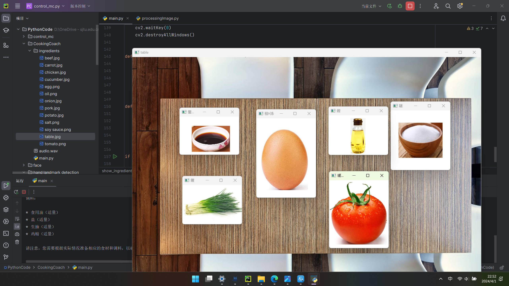

宫保鸡丁

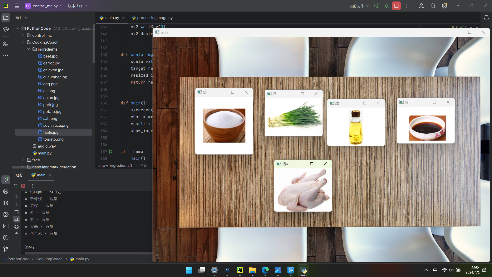

土豆炖牛肉

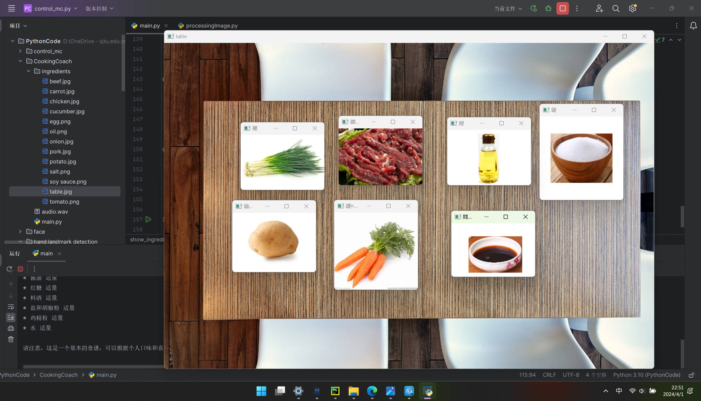

### 5.2作业2：完成挑战8，语音对话，优化函数代码

#### 5.2.1codes

```
from aip import AipSpeech
import pyaudio
import wave
import os
import time
import cv2

APP_ID = '58315193'
API_KEY = 'GZkpX29llXlCTtefPUwQMEaf'
SECRET_KEY = 'WGTbzCJXfKpbDvtLTt4Ur36wpKUQD3aP'
CHUNK = 1024
FORMAT = pyaudio.paInt16
CHANNELS = 2
RATE = 8000
RECORD_SECONDS = 5
WAVE_OUTPUT_FILENAME = "audio.wav"

client = AipSpeech(APP_ID, API_KEY, SECRET_KEY)
sub_string1 = "宫保鸡丁"
sub_string2 = "鱼香肉丝"
img1 = cv2.imread("1.jpg", cv2.IMREAD_COLOR)
img2 = cv2.imread("2.jpg", cv2.IMREAD_COLOR)


def mxrecord():
    p = pyaudio.PyAudio()

    stream = p.open(format=FORMAT,
                    channels=CHANNELS,
                    rate=RATE,
                    input=True,
                    frames_per_buffer=CHUNK)

    stream.start_stream()
    print("* 开始录音......")

    frames = []
    for i in range(0, int(RATE / CHUNK * RECORD_SECONDS)):
        data = stream.read(CHUNK)
        frames.append(data)

    stream.stop_stream()

    wf = wave.open(WAVE_OUTPUT_FILENAME, 'wb')
    wf.setnchannels(CHANNELS)
    wf.setsampwidth(p.get_sample_size(FORMAT))
    wf.setframerate(RATE)
    wf.writeframes(b''.join(frames))
    wf.close()


def mxwav2char():
    with open('audio.wav', 'rb') as fp:
        wave = fp.read()

    print("* 正在识别......", len(wave))
    result = client.asr(wave, 'wav', 16000, {'dev_pid': 1536})
    print(result)
    if result["err_no"] == 0:
        for t in result["result"]:
            print(t)
            return t
    else:
        print("没有识别到语音\n", result["err_no"])


def mxTTS(char):
    voice = client.synthesis(char, 'zh', 6, {'vol': 15, 'per': 3, 'spd': 5})
    with open("playback.mp3", 'wb') as fp:
        fp.write(voice)
    os.system("playback.mp3")


while True:
    mxTTS("你好主人，你要吃什么？")
    mxrecord()
    char = mxwav2char()
    if sub_string1 in char:
        mxTTS("好的，宫保鸡丁做好了")
        cv2.imshow("宫保鸡丁", img1)
        cv2.waitKey(0)
        cv2.destroyAllWindows()
    elif sub_string2 in char:
        mxTTS("好的，鱼香肉丝做好了")
        cv2.imshow("鱼香肉丝", img2)
        cv2.waitKey(0)
        cv2.destroyAllWindows()
    time.sleep(1000)
```

## 6.第七次作业 设计思维&加工

### 6.2作业2：设计一个简单的3D模型，到学生创新中心打印出来

#### 6.2.13d建模图

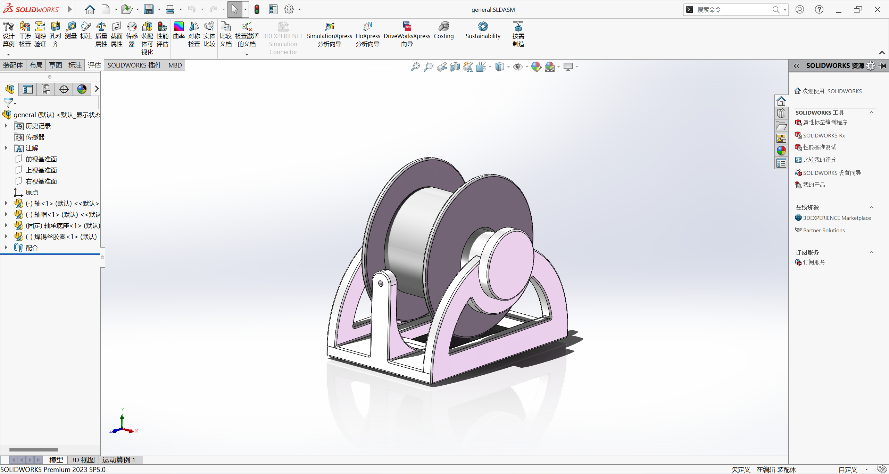

#### 6.2.2实物模型图

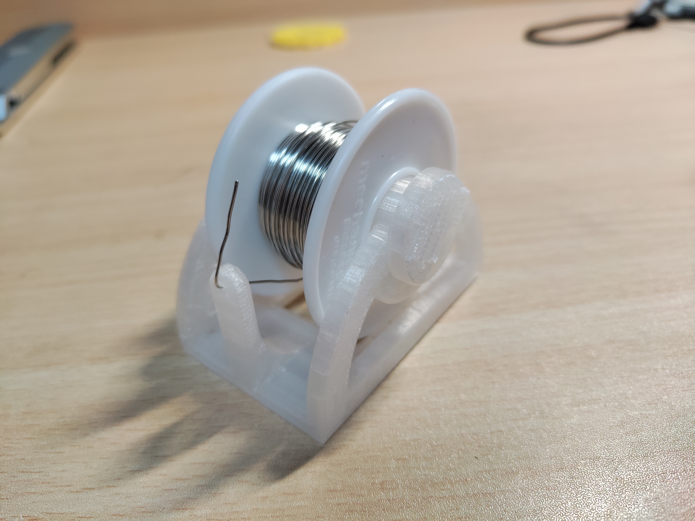

### 6.3作业3：设计arduino盒子，需要露出usb口以及扩展插座，并雕刻自己的名字，   到学生创新中心切割并雕刻出来

#### 6.3.1CAD草图

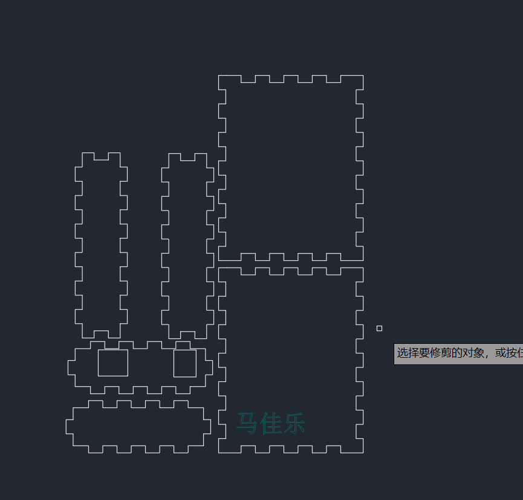

#### 6.3.23D建模图

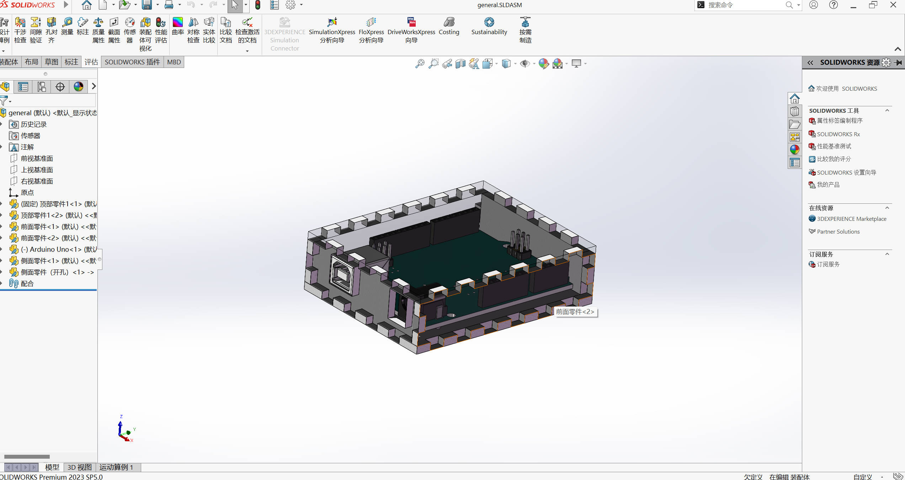

## 7.第八次作业 ESP CAM

### 7.1作业1：在minecraft里面，利用House类以及子类RoundHouse，随机生成房屋名称，大小，颜色，形状（平顶和圆顶）的街区，5行5列，距离15个方块。 玩家进入某一个房屋时，打印出 welcome to xxx‘s house。 提示，利用 isInside函数判断玩家是否在房子里。

#### 7.1.1代码

```
import house
import mcpi.minecraft as minecraft

mc = minecraft.Minecraft.create()

pos = mc.player.getTilePos()
street = []
for i in range(5):
    for j in range(5):
        street.append(house.House(pos.x + 15 * i, pos.y, pos.z + 15 * j))

for i in range(25):
    street[i].buildAll()

while True:
    pos = mc.player.getTilePos()
    for i in range(25):
        street[i].isInside(pos)
```

```
import random
import mcpi.block as block
import mcpi.minecraft as minecraft

mc = minecraft.Minecraft.create()


class House:
    def __init__(self, x, y, z):
        names = ["JiaShuo", "Zangyujie", "Zhangsen", "Majiale", "Kevin", "Peter", "Tom", "Jerry"]
        self.name = random.choice(names)
        self.x = x
        self.y = y
        self.z = z
        self.size = random.randint(4, 10)
        self.color = random.randint(1, 15)

    def __buildWall__(self):
        mc.setBlocks(self.x, self.y, self.z, self.x + self.size, self.y + self.size, self.z + self.size, block.WOOL.id,
                     self.color)
        mc.setBlocks(self.x + 1, self.y + 1, self.z + 1, self.x + self.size - 1, self.y + self.size,
                     self.z + self.size - 1, block.AIR.id)

    def __buildRoof(self):
        mc.setBlocks(self.x, self.y + self.size, self.z, self.x + self.size, self.y + self.size, self.z + self.size,
                     block.WOOL.id,
                     self.color)

    def buildAll(self):
        self.__buildWall__()
        self.__buildRoof()

    def isInside(self, pos):
        if self.x < pos.x < self.x + self.size and self.y < pos.y < self.y + self.size and self.z < pos.z < self.z + self.size:
            mc.postToChat("Welcome %s's house!" % self.name)


class RoundHouse(House):
    def __init__(self, x, y, z, r):
        super(RoundHouse, self).__init__(self, x, y, z)
        self.r = r
        print("I will build a RoundHouse, r is", r)

    def __buildRoof(self):
        print("I will build a round roof, the Radius is", self.r)

    def buildAll(self):
        super(RoundHouse, self).__buildWall__()
        self.__buildRoof()
```

#### 7.1.2截图

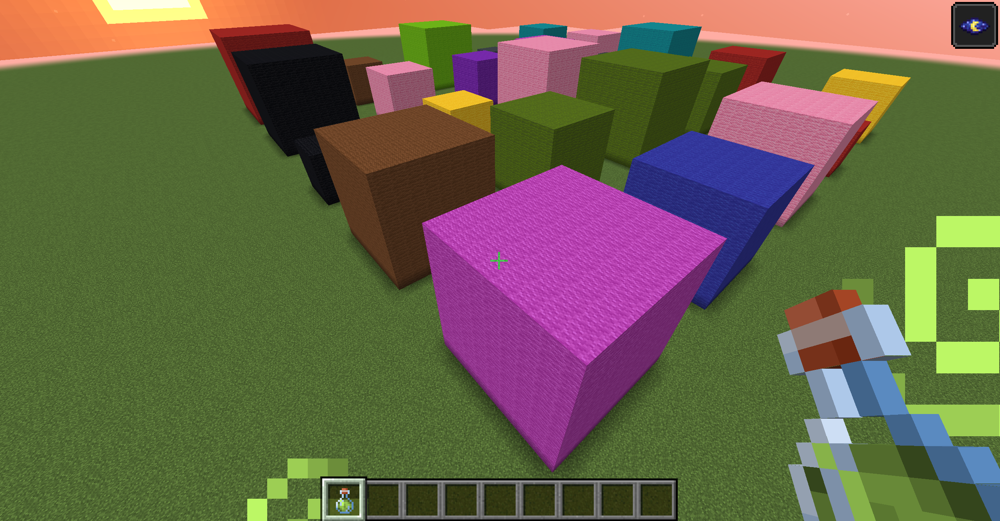

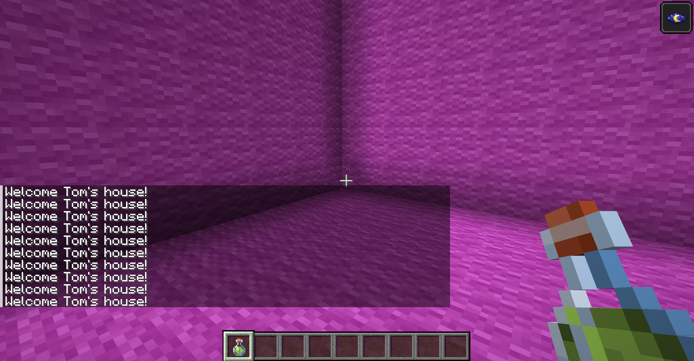

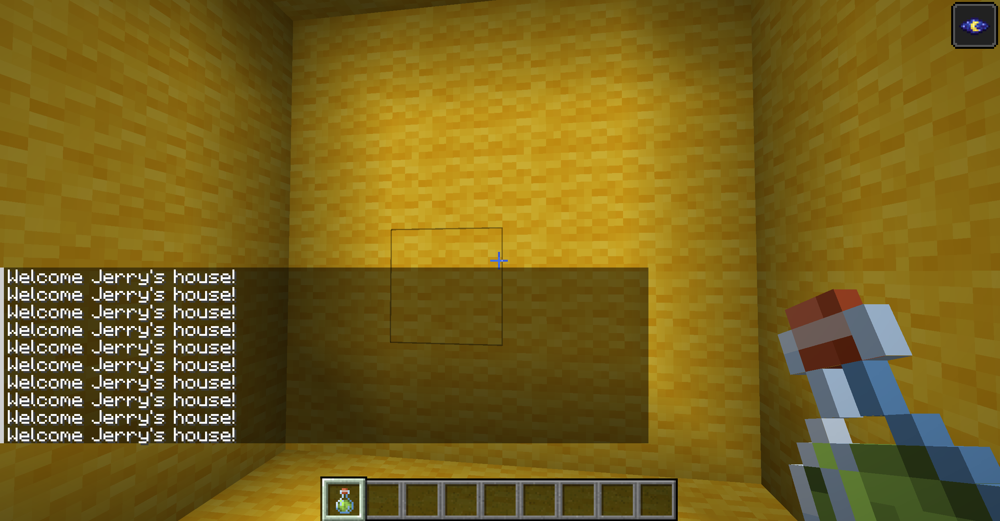

### 7.3作业3：完成esp32 cam视频流调用，完成人脸识别显示，截图保存到个人gitee目录下

